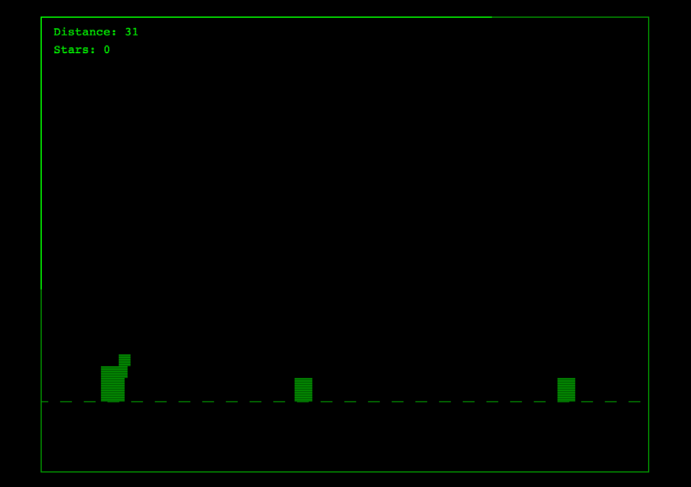

# 8-Bit Llama Runner

A retro-style endless runner game featuring a jumping llama, rendered in classic Apple II-inspired green monochrome graphics.

Play Now! https://proofgeist.github.io/proof-llama-game/

## Description

In this game, you control a llama that must jump over obstacles while collecting stars. The game features:
- Retro green-on-black graphics with CRT scanline effects
- Endless scrolling gameplay
- Collectible stars for bonus points
- Advanced jump mechanics with hang-time control
- Background music with toggle controls
- Classic arcade-style scoring system

## Setup

1. Clone this repository or download the files
2. Add an 8-bit style background music file named `game-music.mp3` to the project directory
3. Open `index.html` in a modern web browser

## Controls

- **SPACE**: Jump
- **UP ARROW**: Hold while jumping to float longer
- **LEFT/RIGHT ARROWS**: Move horizontally
- **M**: Toggle background music
- **SPACE**: Restart game (when game over)

## Scoring

- Distance points increase automatically as you progress
- Collect stars for +100 points each
- Try to get the highest combined score!

## Technical Details

The game is built using:
- HTML5 Canvas for rendering
- Vanilla JavaScript for game logic
- HTML5 Audio for background music
- No external dependencies required

## Files

- `index.html`: Main game page and layout
- `game.js`: Game logic and rendering code
- `game-music.mp3`: Background music file (not included - add your own)

## Browser Compatibility

Works best in modern browsers that support:
- HTML5 Canvas
- ES6+ JavaScript
- HTML5 Audio

## Adding Your Own Music

To add background music:
1. Find or create an 8-bit style music track
2. Save it as `game-music.mp3` in the project directory
3. Make sure it's in a compatible format (MP3)

## Tips

- Use the UP ARROW while jumping to clear larger obstacles
- Time your jumps carefully to collect stars
- Watch out for closely spaced obstacles
- Try to collect stars without hitting obstacles

## License

Feel free to use, modify, and distribute this game as you like! 